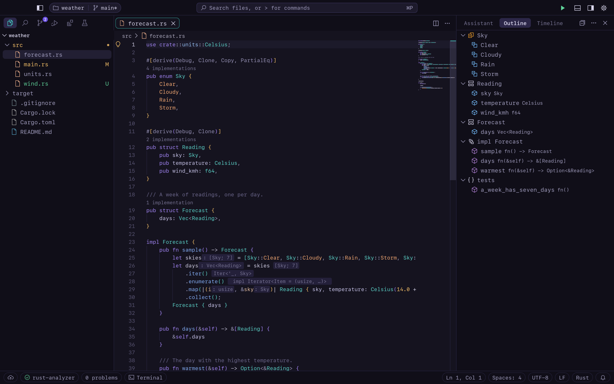

<p align="center"></p>

<h1 align="center">Orbvane</h1>

<p align="center"><b>A native code editor for Mac, written in Rust.</b><br>
Language servers, debugging, git, terminals, tests, an AI assistant and extensions,
drawn by its own GPU toolkit.</p>

<p align="center">
  
  
  
  
  
</p>

<p align="center">
  <a href="https://github.com/sbaruwal/orbvane/releases/latest"><b>Download for macOS</b></a>
  &nbsp;·&nbsp; signed and notarized &nbsp;·&nbsp; Apple Silicon
</p>

<p align="center"><code>brew install --cask sbaruwal/tap/orbvane</code></p>

<p align="center">
  <picture>
    <source media="(prefers-color-scheme: light)" srcset="assets/screenshots/day.png">
    
  </picture>
</p>

## Why Orbvane

- **Native, all the way down.** No browser engine and no web view: a Metal renderer, native menus
  and dialogs, and the Mac shortcuts you already know.
- **Fast.** It starts instantly and stays responsive with huge files: a keystroke in a
  million-line file takes well under a millisecond.
- **Complete.** Language servers, debugging, git, terminals, tasks, tests and extensions are built in.
- **Private.** No telemetry. It goes online only for extensions and its own updates.
- **Calm by design.** Its own Orbvane Night, Day and Dark themes, with the whole interface set
  in SF Mono.

## Features

Click a section to expand it.

<details>
<summary><b>The window</b>: toolbar, side bars, panel and themes</summary>

<br>

- **Toolbar:** the sidebar toggle; a pill with the project (click for Open Recent) and its branch
  (click for Checkout to...); the search field (Go to File, or type `>` for commands); Run; the
  panel and secondary side bar toggles; and the gear menu.
- **Sidebar:** a row of view buttons at its top (Explorer, Search, Source Control, Run and Debug,
  Extensions, Testing, and views that extensions add), with badges for changes, test results
  and updates. Clicking the active view hides the sidebar. The Explorer is headed by the
  project's name.
- **Welcome page** (Help → Welcome): start a file or folder, reopen a recent one, pick a theme,
  set up the Assistant. It opens at startup when nothing else does (`workbench.startupEditor`).
- **Secondary side bar** (⌥⌘B): the Assistant, plus the Outline and Timeline of the active file.
  Drag its edge to resize it.
- **Status bar:** a row of pills for sync, the language server (with its progress; click for its
  output), problems, the terminal, cursor position, indentation, encoding and language.
- **Themes:** Orbvane Night (the default), Orbvane Day (its light pair) and Orbvane Dark (a deep
  graphite), chosen with ⌘K ⌘T. Standard color theme files work too, from extensions or
  `~/Library/Application Support/Orbvane/themes`.
- **Font:** SF Mono, the copy built into macOS, for code and the interface (`editor.fontFamily`;
  Menlo is the fallback). Set `workbench.interfaceFont` to `system` to put the interface back in the
  Mac's system font.

</details>

<details>
<summary><b>Editing</b>: multiple cursors, folding, snippets, Emmet, colors and more</summary>

<br>

- **Multiple cursors:** ⌥-click, ⌥⌘↑/↓, ⌘D, ⇧⌘L, and column selection with ⇧⌥-drag. Undo puts
  every cursor back.
- **Folding** from the language server or by indentation; **word wrap** (⌥Z); **sticky scroll**,
  which keeps the lines that open the surrounding blocks pinned at the top; **minimap**;
  **breadcrumbs** with the symbols at the cursor.
- **Snippets** from language servers and your own, in
  `~/Library/Application Support/Orbvane/User/snippets/` (`rust.json`, or `*.code-snippets` with a
  `scope`). Tab and ⇧Tab move between placeholders.
- **Emmet** in HTML, XML, JSX/TSX and CSS/SCSS/Less: `ul>li.item$*3`, `!`, `lorem20`, `m10`... The
  expansion is offered in the suggestions list. Wrap with Abbreviation is in the palette.
- **Linked editing:** rename an opening tag and its closing tag follows (`editor.linkedEditing`,
  or once with ⇧⌘F2).
- **Colors:** a swatch before each color value, with a picker (saturation, hue, opacity; rgb, hsl
  or hex).
- **Images** open in a preview (PNG, JPEG, GIF, TIFF, BMP, WebP, HEIC, ICO). **Markdown** has a
  live preview (⇧⌘V).
- **Large files** (over 20 MB or 300,000 lines) open instantly. Only the visible lines are
  highlighted, and the heavier features are switched off for them.
- **Sessions:** Orbvane reopens your folder with its editors, layout, breakpoints and window size.
  Quitting never asks about unsaved changes: they're kept, untitled files too (`files.hotExit`).

</details>

<details>
<summary><b>Languages</b>: 48 languages, built-in JSON/HTML/CSS servers, any language server</summary>

<br>

**Highlighting** uses tree-sitter for 36 grammars, plus embedded languages (`<script>` and `<style>`
in HTML, HTML in PHP, Markdown code fences). The rest use a keyword lexer.

**Language servers** start when you open a file, one per workspace folder. Out of the box Orbvane
uses `rust-analyzer`, `gopls`, `clangd`, `pyright-langserver`, `typescript-language-server`,
`sourcekit-lsp`, `yaml-language-server`, `taplo`, `bash-language-server`, `jdtls`, `csharp-ls`,
`ruby-lsp`, `lua-language-server`, `intelephense`, `kotlin-language-server`, `dart`, `zls`,
`docker-langserver`, `metals`, `elixir-ls` and `haskell-language-server`. When one isn't
installed, a notification offers to install it.

They give you diagnostics, hover, completion, signature help, go to definition and references,
peek, call and type hierarchies, rename, code actions (⌘. or the lightbulb), formatting (also on
save), semantic highlighting, inlay hints, code lenses and workspace symbols.

**Built in, nothing to install:** our own servers for **JSON** (with schemas for the editor's own
files, and `"$schema"`), **HTML** (with Format Document: inline content kept on one line, `<style>`
formatted as CSS; JavaScript in `<script>` gets completion, hovers, signature help,
go to definition and errors from the JavaScript server), and **CSS, SCSS and Less** (completion and hovers from browser
data with MDN descriptions, lint warnings, colors, rename).

Idle servers stop after 10 minutes to free memory and start again when needed
(`languageServers.stopWhenIdle`, `languageServers.idleMinutes`).

<details>
<summary>Adding or changing a language</summary>

Put changes in `~/Library/Application Support/Orbvane/User/languages.json` (read at startup):

```jsonc
{
  "languages": [
    // Headers are C++ here.
    { "id": "cpp", "extensions": [".h", ".hpp", ".cpp"] },
    // A server of your own.
    { "id": "rust", "languageServer": { "command": "ra-multiplex", "args": ["client"] } },
    // A new language.
    { "id": "gleam", "name": "Gleam", "extensions": [".gleam"], "lineComment": "//",
      "keywords": ["fn", "pub", "let", "type"], "languageServer": { "command": "gleam", "args": ["lsp"] } }
  ]
}
```

Fields: `name`, `aliases`, `extensions`, `filenames`, `lineComment`, `blockComment`, `keywords`,
`controlKeywords`, `constants`, `grammar`, and `languageServer` (`command`, `args`,
`initializationOptions`, `settings`, `install`, `heavy`; `null` turns the server off).

Built-in grammars: `rust`, `python`, `go`, `c`, `cpp`, `javascript`, `typescript`, `tsx`, `json`,
`toml`, `bash`, `html`, `css`, `scss`, `yaml`, `xml`, `java`, `c_sharp`, `ruby`, `swift`, `lua`,
`sql`, `make`, `php`, `kotlin`, `zig`, `scala`, `haskell`, `elixir`, `markdown`, `dockerfile`,
`dart`, `diff`, `ini`, `objc`, `r`.

</details>

</details>

<details>
<summary><b>Git</b>: source control, graph, merge editor and timeline</summary>

<br>

- The Source Control view covers the everyday workflow: stage, commit (also Amend, Commit &
  Push/Sync, Undo Last Commit), branches, merge and rebase, fetch/pull/push/sync, stashes,
  remotes, tags and clone. A graph shows the history.
- Stage, unstage or revert just the selected lines. Changes are marked in the gutter, and diffs
  open in their own tabs.
- **Merge conflicts** get Accept Current / Incoming / Both in the editor, or a three-way
  **merge editor**.
- **Timeline** (secondary side bar) lists the commits that changed the active file.
- Credential prompts (passwords, passphrases, host keys) appear in the editor's own input box.
  git's credential helpers and ssh-agent are tried first.

</details>

<details>
<summary><b>Debugging</b>: native, Python, Go and Node.js</summary>

<br>

Run and Debug (⇧⌘D, F5) starts the configurations in `.orbvane/launch.json`. Without one, F5 offers
to create one.

| `"type"` | Debugs | With |
|---|---|---|
| `lldb-dap` | Rust, C, C++, Swift | `lldb-dap` (on the PATH or in Xcode) |
| `debugpy` | Python | `debugpy`, with the workspace's `.venv` |
| `go` | Go | Delve (`dlv dap`), launch or attach |
| `node` | Node.js, TypeScript | our own adapter, with source maps |

While stopped you get Variables, Watch, Call Stack, Breakpoints, a floating toolbar, values on
hover, and the Debug Console. Breakpoints can have conditions, hit counts and log messages, and
they move with your edits. The first time, macOS asks for permission to debug ("Developer Tools
Access").

</details>

<details>
<summary><b>Testing</b>: Rust, Go and Python tests in a test explorer</summary>

<br>

The Testing view shows the folder's tests as a tree with their states, a filter and a summary.
Run, debug or go to any test. Run icons and results appear in the editor's margin, failures
show their message after the failing line, and Test Results has the output.

- **Rust:** through rust-analyzer, without building first.
- **Go:** `go test -json`, including subtests, benchmarks and fuzz tests, with "run test | debug
  test" lenses.
- **Python:** pytest, run with the workspace's interpreter and debugged with debugpy.

</details>

<details>
<summary><b>Terminal, tasks and search</b></summary>

<br>

- **Terminal** (⌃\`): our own xterm-compatible emulator, with split panes (⌘\\), tabs and
  scrollback.
- **Tasks** (⇧⌘B, Terminal > Run Task...): `.orbvane/tasks.json`, plus detected tasks for Cargo,
  Go and `package.json` scripts. They run through your login shell, each in its own terminal.
- **Search** (⇧⌘F): parallel search across the project that respects `.gitignore`, with regex,
  include/exclude globs and replace. **Search Editor** (⌘Enter) puts results in an editor tab you
  can save.

</details>

<details>
<summary><b>Assistant</b>: chats with the coding agents of your choice</summary>

<br>

The Assistant (⇧⌘I) chats with coding agents working in the open folder. Pick the agent when you
first open it, or later from the chat's header (or **Assistant: Select Agent**):

- **Claude Code** and **Codex:** Orbvane talks to their command line tools (`claude`, `codex`)
  directly, with no adapter to install. If one isn't installed or signed in, the Assistant offers
  to do that in a terminal.
- **Any other agent** that speaks the [Agent Client Protocol](https://agentclientprotocol.com):
  give the command that starts it (**Custom Command…**). It runs through your login shell.

Chats:

- Each chat has its own agent, and they run side by side: say, Codex on one change while Claude
  Code works on another, or several of either. Open chats are tabs above the transcript; **+**
  starts one with the agent you pick. A dot on a tab means it waits for you (a question) or has
  finished while you were elsewhere.
- Chats are kept per folder until you delete them. **History** (the clock button, or
  **Assistant: Show Chat History**) lists them; right-click a tab to rename, close or delete it.
- Reopened later, a chat continues where it left off: the agent picks up its earlier
  conversation. An agent idle for 10 minutes stops, and starts again with the next message.

Each chat's header shows its agent, permission mode and model, and switches them:

| Mode | Claude Code | Codex |
|---|---|---|
| **Ask** | Asks before editing files and running commands | Asks before running commands and changing files |
| **Accept Edits** | Edits without asking; asks before commands | (not offered) |
| **Auto** | Claude Code decides which actions are safe without asking | Works in the folder without asking (in its sandbox); asks to go outside it or online |
| **Plan** / **Read Only** | Plans first; you approve the plan before it changes anything | Reads and answers; changes nothing |
| **Full Access** | Anything, without asking | Anything, without asking, outside the sandbox |

New chats start in `assistant.permissions` (Ask unless you change it). Full Access asks you to
confirm and shows a warning in the header.

In a chat:

- The current file and selection go with each message. Click the file's chip to leave it out.
- Replies stream in with the agent's thoughts, plan and tool calls.
- Before it changes a file or runs a command, it asks you. **Review Changes** shows the proposed
  edit as a diff.
- **Editor tools:** the agent can ask Orbvane's language servers for definitions, references,
  hovers and symbols, and read the Problems list (`assistant.editorTools`).
- Agents that speak the protocol read files through the editor, unsaved changes included, and
  their edits land as one undo step. Claude Code and Codex read and write files on disk, so files
  with unsaved changes are saved before each message (`assistant.saveBeforeSending`), and open
  files reload when they change them.

</details>

<details>
<summary><b>Extensions</b>: written in Rust, from Orbvane's registry or Open VSX</summary>

<br>

An extension is a folder with a `package.json` and, for code, a Rust program built with the
`orbvane-extension` crate. It runs in its own process and can add commands, notifications, quick
picks, status bar items, output channels, tree views, text decorations, hovers, completions,
definitions and diagnostics.

Anything a `package.json` contributes works with or without code: commands, keybindings,
color themes, snippets, languages (a language server extension needs no code), settings and
JSON schemas.

The Extensions view (⇧⌘X) installs from:

- **[Orbvane's registry](https://github.com/sbaruwal/orbvane-extensions):** extensions built from
  source by the registry's CI for both Mac architectures.
- **[Open VSX](https://open-vsx.org):** their contributions (themes, snippets, languages...) work.
  Their JavaScript code doesn't run.

Downloads are checked against the registry's SHA-256, and updates are installed automatically
(`extensions.autoUpdate`).

<details>
<summary>Writing and publishing an extension</summary>

See `examples/extensions/word-count` (a minimal one) and `examples/extensions/todo-tree` (views,
decorations, providers and diagnostics). Implement `Extension` and call `orbvane_extension::run`.

```bash
cargo install --path crates/cargo-orbvane
cargo orbvane package          # in the extension's folder; --target arm64|x64|all
```

This writes `<name>-<version>.vsix` with the program in `bin/<arch>/`. Install it with Extensions:
Install from VSIX..., or use Developer: Install Extension from Location... while developing.

</details>

</details>

<details>
<summary><b>Workspaces</b>: several folders in one window</summary>

<br>

File > Add Folder to Workspace... puts several folders in one window, saved as a `.code-workspace`
file. Search, Go to File, language servers, tests and source control cover every folder.

</details>

## Keyboard shortcuts

These are the defaults. Change any of them with ⌘K ⌘S, or in `keybindings.json`
(`{ "key": "cmd+k cmd+m", "command": "editor.action.toggleMinimap" }`, with `"-command"` to remove
one).

<details>
<summary><b>General</b></summary>

| Shortcut | Action |
|---|---|
| ⇧⌘P / ⌘P | Command palette / Go to file |
| ⌘, | Settings |
| ⌘K ⌘T | Color theme |
| ⌘B / ⌘J / ⌥⌘B | Toggle sidebar / panel / secondary side bar |
| ⇧⌘I | Assistant |
| ⇧⌘X | Extensions |
| ⌘K Z | Zen Mode (Esc Esc leaves) |
| ⌘K M | Change language mode |
| ⌃R | Open recent |
| ⌘K ⌘S | Keyboard shortcuts |
| ⌘S / ⇧⌘S / ⌥⌘S | Save / save as / save all |
| ⌘W, ⌥⌘T, ⌘K ⌘W | Close editor / other editors / all editors |
| ⌘\\, ⌘1–3 | Split editor / focus group |

</details>

<details>
<summary><b>Editing</b></summary>

| Shortcut | Action |
|---|---|
| ⌘/ | Toggle line comment |
| ⌥-click, ⇧⌥-drag | Add a cursor, column selection |
| ⌥⌘↑ / ⌥⌘↓ | Add cursor above / below |
| ⌘D, ⇧⌘L | Add next occurrence, select all occurrences |
| ⌥⇧I | Cursors at line ends |
| ⌥Z | Toggle word wrap |
| ⌥⌘[ / ⌥⌘] | Fold / unfold |
| ⌘K ⌘0 / ⌘K ⌘J | Fold all / unfold all |
| ⇧⌘\\ | Go to bracket |
| ⌃Space / ⇧⌘Space | Suggestions / parameter hints |
| ⇧⌥F | Format document |
| ⌘F / ⌥⌘F | Find / replace |
| ⇧⌘V / ⌘K V | Markdown preview / to the side |

</details>

<details>
<summary><b>Code navigation</b></summary>

| Shortcut | Action |
|---|---|
| F12 / ⌘-click | Go to definition |
| ⌥F12 / ⇧F12 | Peek definition / references |
| ⌥⇧H | Call hierarchy |
| F2 | Rename symbol |
| ⇧⌘F2 | Linked editing |
| ⌘. | Quick fix |
| ⇧⌘O / ⌘T | Symbol in file / in workspace |
| ⌃G | Go to line |

On a laptop keyboard, F-keys may need fn (or System Settings > Keyboard > "Use F1, F2, etc. keys as
standard function keys").

</details>

<details>
<summary><b>Search, git and terminal</b></summary>

| Shortcut | Action |
|---|---|
| ⇧⌘F / ⇧⌘H | Search / replace in files |
| ⌘Enter (Search view) | Open results in a Search Editor |
| ⌥⌘C / ⌥⌘W / ⌥⌘R | Match case / whole word / regex |
| ⌃⇧G, then ⌘Enter | Source Control, commit |
| ⌘K ⌘⌥S / ⌘K ⌘N / ⌘K ⌘R | Stage / unstage / revert selected lines |
| F7 / ⇧F7 | Next / previous difference |
| ⌃\` / ⌃⇧\` | Toggle terminal / new terminal |
| ⌘\\ / ⌘K (terminal) | Split / clear terminal |
| ⇧⌘B | Run build task |
| ⇧⌘U | Output panel |

</details>

<details>
<summary><b>Debugging and testing</b></summary>

| Shortcut | Action |
|---|---|
| F5 / ⌃F5 | Start debugging / run without debugging |
| ⇧F5 / ⇧⌘F5 / F6 | Stop / restart / pause |
| F10 / F11 / ⇧F11 | Step over / into / out |
| F9 | Toggle breakpoint |
| ⇧⌘D / ⇧⌘Y | Run and Debug / Debug Console |
| ⌘; A / ⌘; C / ⌘; F | Run all tests / test at cursor / file's tests |
| ⌘; ⌘C / ⌘; L / ⌘; E | Debug test at cursor / rerun last / rerun failed |

</details>

## Settings

Settings (⌘,) has a searchable editor with User and Workspace tabs. The files are
`~/Library/Application Support/Orbvane/User/settings.json` and `.orbvane/settings.json`. Comments
and formatting in them are kept when the editor changes them.

<details>
<summary>Commonly changed settings</summary>

| Setting | What it does |
|---|---|
| `workbench.colorTheme` | Orbvane Night, Orbvane Day, Orbvane Dark, or an installed theme |
| `editor.fontFamily`, `editor.fontSize` | The code font (SF Mono by default) |
| `workbench.interfaceFont` | `editor` (the code font) or `system` |
| `editor.wordWrap`, `editor.minimap.enabled` | Word wrap, minimap |
| `editor.formatOnSave`, `files.autoSave` | Format on save, auto save |
| `editor.inlayHints.enabled`, `editor.codeLens` | Inline hints, code lenses |
| `editor.stickyScroll.enabled` | Sticky scroll |
| `files.hotExit` | Keep unsaved changes across quits |
| `git.autofetch`, `git.confirmSync` | Background fetch, ask before sync |
| `languageServers.stopWhenIdle` | Stop idle language servers |
| `assistant.agent`, `assistant.agent.command` | The agent new chats talk to (or a custom command) |
| `assistant.permissions` | The permission mode new chats start in |
| `update.mode` | `default`, `manual` or `none` |

Every setting is listed with its description in the Settings editor.

</details>

## Known limitations

- **Mac only:** macOS 14 or later on Apple Silicon. There are no Intel, Linux or Windows builds.
- **Local folders only:** no remote development over SSH or in containers, no settings sync and no
  shared editing sessions.
- **Notebooks** (`.ipynb`) open as plain JSON.
- **Extensions:** extensions from Open VSX contribute themes, snippets, languages and settings, but
  their JavaScript code doesn't run. Extensions can't show web views.
- **Language features come from language servers.** Orbvane offers to install a missing one, but
  some languages have only highlighting until you do.
- **Debugging:** native debugging uses `lldb-dap` from the Command Line Tools. The Node.js
  debugger doesn't follow child processes or workers.
- **Assistant:** Claude Code and Codex read files from disk, so Orbvane saves your unsaved changes
  before each message (`assistant.saveBeforeSending`).

Found something else? [Open an issue](https://github.com/sbaruwal/orbvane/issues/new/choose).

## Updates and privacy

Orbvane updates itself. It checks GitHub for a new release at startup and every 12 hours,
downloads it in the background, and installs it only if the checksum matches and it's signed by the
same developer. **Update Now** restarts into it and keeps your session; **Later** installs it when
you quit. `update.mode` can be `manual` or `none`.

**No telemetry.** Orbvane goes online only for extensions ([open-vsx.org](https://open-vsx.org)
and GitHub) and its own update check. Everything else (git, language servers, debuggers, tasks)
runs on your Mac. The Assistant runs only the agent you set up, and what that agent sends is up to
it.

## Building from source

```bash
git clone https://github.com/sbaruwal/orbvane.git
cd orbvane
cargo run --release -- <folder> [files...]
```

Needs a recent stable Rust on macOS 14 or later. To contribute, see [CONTRIBUTING.md](CONTRIBUTING.md).

<details>
<summary>How it's built, and the crates</summary>

<br>

The UI toolkit is our own: layout, widgets, the GPU renderer, the glyph atlas, icons and theming.
Crates are used only for the low-level pieces: `winit` (window and events), `wgpu` (Metal),
`cosmic-text` (font shaping), `ropey` (text rope), `tree-sitter` and grammars (parsing), `vte`
(terminal escape sequences), `regex` (search), `muda` (native menu bar), `rfd` (native dialogs),
`arboard` (clipboard), and `objc2`/`dispatch2` (a few direct AppKit calls).

| Crate | Purpose |
|---|---|
| `acp` | Agent Client Protocol client for the Assistant; `claude`, `codex`: Claude Code and Codex behind that protocol; `mcp`: the editor's tools as a Model Context Protocol server |
| `app` | Platform layer (`main.rs`) and the workbench: everything drawn |
| `cargo-orbvane` | `cargo orbvane package` (extensions to `.vsix`) and `cargo orbvane registry` (the registry's CI) |
| `css` | CSS, SCSS and Less language server |
| `dap` | Debug Adapter Protocol client |
| `extension-api` | `orbvane-extension`, the crate extension authors use |
| `extensions` | Installed extensions, manifests, VSIX installs, the marketplace client |
| `fswatch` | Folder watching with FSEvents |
| `html` | HTML language server |
| `jsdebug` | Node.js debug adapter (inspector protocol over our own WebSocket, source maps) |
| `json` | JSON language server with JSON Schema |
| `language` | Language registry and tree-sitter highlighting |
| `lsp` | Language Server Protocol client (and the server side our servers share) |
| `render` | wgpu renderer: quads, text, icons, layers and clipping |
| `scm` | git through its CLI, status, graph layout, Myers diff |
| `search` | `.gitignore`-aware parallel search and replace |
| `settings` | Settings schema, layers and JSONC edits |
| `terminal` | PTY and xterm-compatible emulator |
| `text` | Rope buffer, multi-cursor edits, undo |
| `theme` | Color themes and the color registry |

`cargo build` should give no warnings, and `cargo test` should pass. After changing dependencies,
regenerate the notices with `python3 tools/third_party_notices.py`.

</details>

## License

Orbvane is licensed under either of [Apache License, Version 2.0](LICENSE-APACHE) or
[MIT license](LICENSE-MIT), at your option. Unless you explicitly state otherwise, any contribution
intentionally submitted for inclusion in Orbvane, as defined in the Apache-2.0 license, shall be
dual licensed as above, without any additional terms or conditions.

Third-party material and the licenses of the crates Orbvane is built from are listed in
[THIRD-PARTY-NOTICES.md](THIRD-PARTY-NOTICES.md).
